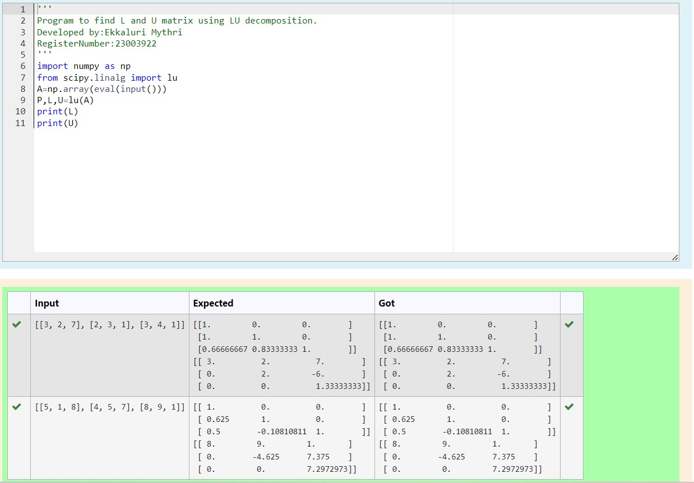
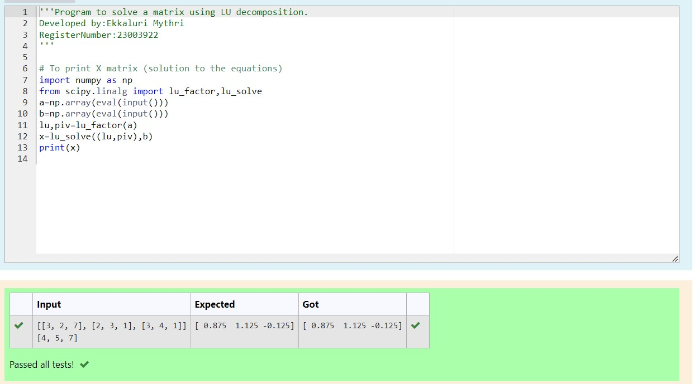

# LU Decomposition 

## AIM:
To write a program to find the LU Decomposition of a matrix.

## Equipments Required:
1. Hardware – PCs
2. Anaconda – Python 3.7 Installation / Moodle-Code Runner

## Algorithm
1. import numpy as np
2. from scipy package import lu
3. get input from the user
4. print result

## Program:
(i) To find the L and U matrix
```
Program to find the L and U matrix.
Developed by: Ekkaluri Mythri
RegisterNumber: 23003922

import numpy as np
from scipy.linalg import lu
A=np.array(eval(input()))
P,L,U=lu(A)
print(L)
print(U)
```
(ii) To find the LU Decomposition of a matrix
```
Program to find the LU Decomposition of a matrix.
Developed by:Ekkaluri Mythri
RegisterNumber:23003922

# To print X matrix (solution to the equations)
import numpy as np
from scipy.linalg import lu_factor,lu_solve
a=np.array(eval(input()))
b=np.array(eval(input()))
lu,piv=lu_factor(a)
x=lu_solve((lu,piv),b)
print(x)

```

## Output:




## Result:
Thus the program to find the LU Decomposition of a matrix is written and verified using python programming.

